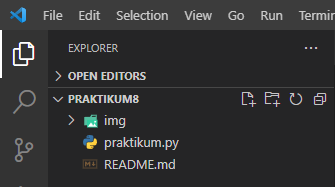
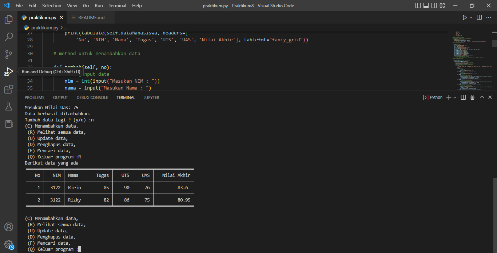
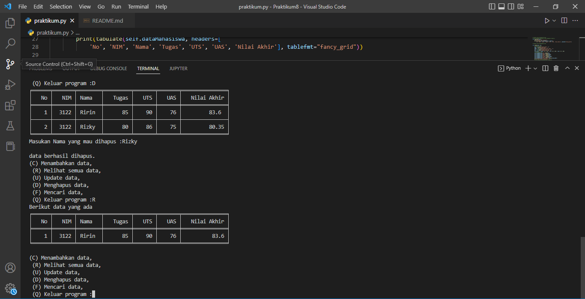
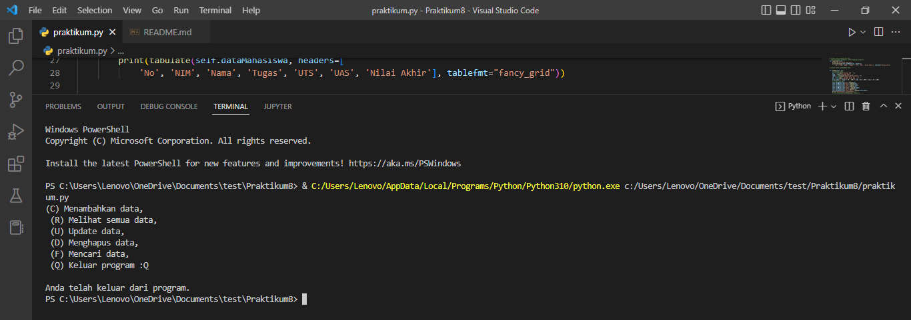

# Pertemuan12-praktikum8

Repositiry ini dibuat untuk memenuhi tugas Bahasa Pemrograman (Praktikum 8)<br><br>
Nama : Ririn Nofrima <br>
NIM : 312210025<br>
Dosen : Agung Nugroho, M.Kom<br>
Matkul : Bahasa Pemrograman<br>
Kelas : TI.22.B.1<br>

## Latihan  OOP pada python menggunakan class dan menginstansiasi sebuah class lalu  membuat program crud sederhana dengan class

### Repository ini dibuat sebagai tugas kuliah bahasa pemrogramman

1. Pertama kita buat buat folder `Praktikum8` dan didalam kita buat file bernama `Praktikum.py`

      


2. Kita akan buat program crud sederhana dan berikut `flowchart` dan `class diagram` program yang akan dibuat.

      flowchart :

      

      class diagram :

      


3. Lalu buka file `Praktikum.py` dan masukan codingan sebagai berikut, lalu run dengan mengetikan perintah berikut diterminal `python Praktikum.py`:

```python
# import tabulate
from tabulate import tabulate

# Ririn Nofrima
# TI22B1

# membuat class dengan nama Mahasiswa


class Mahasiswa:
    def __init__(self):
        # membuat properti dataMahasiswa bertipe dictionary
        self.dataMahasiswa = {
            'No': [],
            'Nim': [],
            'Nama': [],
            'Tugas': [],
            'Uts': [],
            'Uas': [],
            'Nilai Akhir': []
        }

    # method untuk menampilkan data
    # self merupakan parameter untuk mengakses properti,
    def tampilkan(self):
        print("Berikut data yang ada")
        print(tabulate(self.dataMahasiswa, headers=[
            'No', 'NIM', 'Nama', 'Tugas', 'UTS', 'UAS', 'Nilai Akhir'], tablefmt="fancy_grid"))
    
    # method untuk menambahkan data

    def tambah(self, no):
        # menginput data
        nim = int(input("Masukan NIM : "))
        nama = input("Masukan Nama : ")
        tugas = int(input("Masukan Nilai Tugas : "))
        uts = int(input("Masukan Nilai Uts : "))
        uas = int(input("Masukan Nilai Uas: "))
        nilai_akhir = (tugas * 30 / 100) + (uts * 35 / 100) + (uas * 35 / 100)
        # menambahkan data
        self.dataMahasiswa['No'].append(no)
        self.dataMahasiswa['Nim'].append(nim)
        self.dataMahasiswa['Nama'].append(nama)
        self.dataMahasiswa['Uts'].append(uts)
        self.dataMahasiswa['Tugas'].append(tugas)
        self.dataMahasiswa['Uas'].append(uas)
        self.dataMahasiswa['Nilai Akhir'].append(nilai_akhir)
        print('Data berhasil ditambahkan.')
        # print(tabulate(dataMahasiswa, headers=[
        #     'NIM', 'Nama', 'Tugas', 'UTS', 'UAS', 'Nilai Akhir'], tablefmt="fancy_grid"))

    # method untuk mengedit data

    def ubah(self, nama):
        # cek jika ada nama tersebut di dataMahasiswa
        if nama in self.dataMahasiswa['Nama']:
            # cari posisi indexnya lalu disimpan di nimIndex
            namaIndex = self.dataMahasiswa['Nama'].index(nama)
            print("Pilih Data yang mau diedit")
            # perulangan mengedit data dalam bentuk pilihan
            while True:
                editApa = int(input(
                    "(1) Nim, \n (2) Nama, \n (3) Nilai Tugas, \n (4) Nilai Uts, \n (5) Nilai Uas, \n (0) Save Perubahan & exit \n : "))
                print("")

                if editApa == 1:
                        # merubah nim
                        newNim = int(input("Masukan Nim :"))
                        self.dataMahasiswa['Nim'][namaIndex] = newNim
                elif editApa == 2:
                        # merubah na,a
                        newNama = input("Masukan Nama :")
                        self.dataMahasiswa['Nama'][namaIndex] = newNama
                elif editApa == 3:
                        #merubah nilai tugas & nilai akhir
                        newTugas = int(input("Masukan Nilai Tugas :"))
                        nilai_akhir = (newTugas * 30 / 100) + (self.dataMahasiswa['Uts'][namaIndex] * 35 / 100) + (
                            self.dataMahasiswa['Uas'][namaIndex] * 35 / 100)
                        self.dataMahasiswa['Tugas'][namaIndex] = newTugas
                        self.dataMahasiswa['Nilai Akhir'][namaIndex] = nilai_akhir
                elif editApa == 4:
                        # merubah nilai uts & nilai akhir
                        newUts = int(input("Masukan Nilai Uts :"))
                        nilai_akhir = (self.dataMahasiswa['Tugas'][namaIndex] * 30 /100) + (newUts * 35 / 100) + (
                            self.dataMahasiswa['Uts'][namaIndex] * 35 / 100)
                        self.dataMahasiswa['Uts'][namaIndex] = newUts
                        self.dataMahasiswa['Nilai Akhir'][namaIndex] = nilai_akhir
                elif editApa == 5:
                        # merubah nilai uas & nilai akhir
                        newUas = int(input("Masukan Nilai Uas :"))
                        nilai_akhir = (self.dataMahasiswa['Tugas'][namaIndex] * 30 / 100) + (self.dataMahasiswa['Uts'][namaIndex] * 35 / 100) + (
                            newUas * 35 / 100)
                        self.dataMahasiswa['Uas'][namaIndex] = newUas
                        self.dataMahasiswa['Nilai Akhir'][namaIndex] = nilai_akhir
                elif editApa == 0:
                        print('Perubahan Data berhasil disimpan,')
                        break
        else:
            print("data tidak ditemukan")

    # fungsi untuk menghapus data

    def hapus(self, nama):
        if nama in self.dataMahasiswa['Nama']:
            namaIndex = self.dataMahasiswa['Nama'].index(nama)
            # menghapus data berdasarkan position index pada nama
            del self.dataMahasiswa['No'][namaIndex]
            del self.dataMahasiswa['Nim'][namaIndex]
            del self.dataMahasiswa['Nama'][namaIndex]
            del self.dataMahasiswa['Tugas'][namaIndex]
            del self.dataMahasiswa['Uts'][namaIndex]
            del self.dataMahasiswa['Uas'][namaIndex]
            del self.dataMahasiswa['Nilai Akhir'][namaIndex]
            print("data berhasil dihapus. ")
        else:
            print("data tidak ditemukan")

# fungsi untuk mencari data


# melakukan perulangan menggunakan while sampai user menekan huruf Q perulangan akan
no = 0
# instansiasi class mahasiswa dengan nama instanceMhs
instanceMhs = Mahasiswa()

# melakukan perulangan sampai kondisi tertentu terpenuhi perulangan akan berhenti
while True:
    # opsi input pilihan C,R,U,D,Q
    tanya = input(
        "(C) Menambahkan data,\n (R) Melihat semua data,\n (U) Update data,\n (D) Menghapus data,\n (F) Mencari data,\n (Q) Keluar program :")
    if tanya == "C":
        # melakukan perulangan hingga user memilih n maka perulangan akan berhenti
        while True:
            no += 1
            # memanggil fungsi tambahData dan memparsing data no
            instanceMhs.tambah(no)
            tambahDataLagi = input("Tambah data lagi ? (y/n) :")
            if tambahDataLagi == 'n':
                break
        # jika tanya == R maka lihat data
    elif tanya == "R":
        # menampilkan data dalam bentuk table menggunakan package tabulate
        instanceMhs.tampilkan()
        print("")
        # jika tanya == D maka edit data
    elif tanya == "U":
        print(tabulate(instanceMhs.dataMahasiswa, headers=[
            'No', 'NIM', 'Nama', 'Tugas', 'UTS', 'UAS', 'Nilai Akhir'], tablefmt="fancy_grid"))
        nama = input('Masukan Nama yang mau diedit :')
        print("")
        instanceMhs.ubah(nama)
        # jika tanya == D maka hapus data
    elif tanya == "D":
        print(tabulate(instanceMhs.dataMahasiswa, headers=[
            'No', 'NIM', 'Nama', 'Tugas', 'UTS', 'UAS', 'Nilai Akhir'], tablefmt="fancy_grid"))
        nama = input('Masukan Nama yang mau dihapus :')
        print("")
        instanceMhs.hapus(nama)
    # jika tanya == Q maka keluar dari program
    elif tanya == "Q":
        print("")
        print("Anda telah keluar dari program.")
        break
```

* dan Berikut hasilnya : <br>

* Jika memilih opsi `C = menambah data` maka akan tampil sebagai berikut : <br>

<br>

* Jika memilih opsi `R = Melihat semua data` maka akan tampil sebagai berikut : <br>

<br>

* Jika memilih opsi `U = mengupdate data` maka akan tampil sebagai berikut : <br>

<br>


* Jika memilih opsi `D = Menghapus data` maka akan tampil sebagai berikut : <br>

<br>

* Jika memilih opsi `Q = Keluar Program` maka akan tampil sebagai berikut : <br>

<br>

### selesai. seperti itulah program crud sederhana yang kita buat, menggunakan class pada python